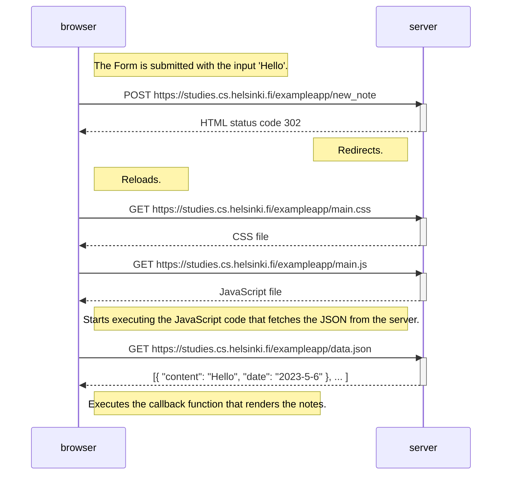

```mermaid
sequenceDiagram
    participant browser
    participant server
    
    Note right of browser: The Form is submitted with the input 'Hello'.

    browser->>server: POST https://studies.cs.helsinki.fi/exampleapp/new_note
    activate server
    server-->>browser: HTML status code 302
    deactivate server

    Note left of server: Redirects.
    Note right of browser: Reloads. 

    browser->>server: GET https://studies.cs.helsinki.fi/exampleapp/main.css
    activate server
    server-->>browser: CSS file
    deactivate server

    browser->>server: GET https://studies.cs.helsinki.fi/exampleapp/main.js
    activate server
    server-->>browser: JavaScript file
    deactivate server

    Note right of browser: Starts executing the JavaScript code that fetches the JSON from the server.

    browser->>server: GET https://studies.cs.helsinki.fi/exampleapp/data.json
    activate server
    server-->>browser: [{ "content": "Hello", "date": "2023-5-6" }, ... ]
    deactivate server

    Note right of browser: Executes the callback function that renders the notes.
```
