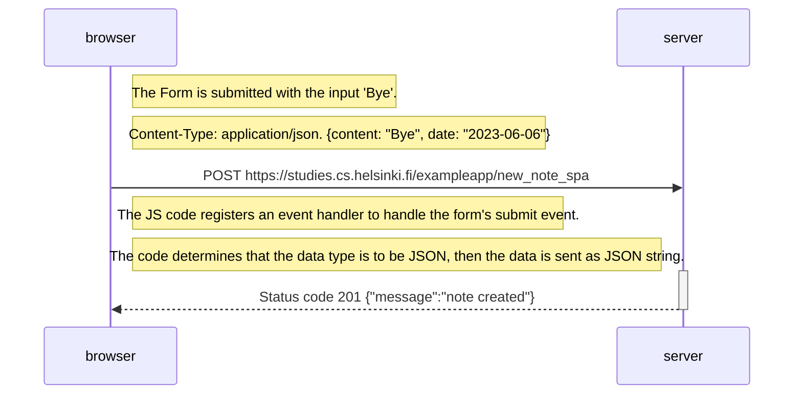

```mermaid
sequenceDiagram
    participant browser
    participant server
    Note right of browser: The Form is submitted with the input 'Bye'.
    Note right of browser: Content-Type: application/json. {content: "Bye", date: "2023-06-06"}

    browser->>server: POST https://studies.cs.helsinki.fi/exampleapp/new_note_spa

    Note right of browser: The JS code registers an event handler to handle the form's submit event.
    Note right of browser: The code determines that the data type is to be JSON, then the data is sent as JSON string.

    activate server
    server-->>browser: Status code 201 {"message":"note created"}
    deactivate server 
``` 
